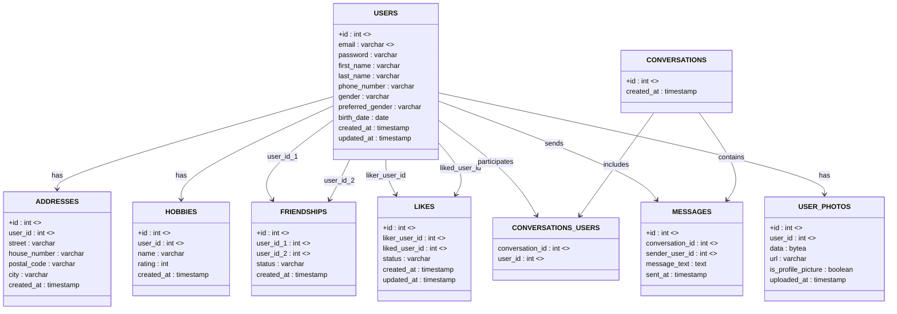

```mermaid
classDiagram
class USERS {
+id : int <<PK>>
email : varchar <<UNIQUE>>
password : varchar
first_name : varchar
last_name : varchar
phone_number : varchar
gender : varchar
preferred_gender : varchar
birth_date : date
created_at : timestamp
updated_at : timestamp
}

    class ADDRESSES {
        +id : int <<PK>>
        user_id : int <<FK>>
        street : varchar
        house_number : varchar
        postal_code : varchar
        city : varchar
        created_at : timestamp
    }

    class HOBBIES {
        +id : int <<PK>>
        user_id : int <<FK, UNIQUE>>
        name : varchar
        rating : int
        created_at : timestamp
    }

    class FRIENDSHIPS {
        +id : int <<PK>>
        user_id_1 : int <<FK>>
        user_id_2 : int <<FK>>
        status : varchar
        created_at : timestamp
    }

    class LIKES {
        +id : int <<PK>>
        liker_user_id : int <<FK>>
        liked_user_id : int <<FK>>
        status : varchar
        created_at : timestamp
        updated_at : timestamp
    }

    class CONVERSATIONS {
        +id : int <<PK>>
        created_at : timestamp
    }

    class CONVERSATIONS_USERS {
        conversation_id : int <<FK>>
        user_id : int <<FK>>
    }

    class MESSAGES {
        +id : int <<PK>>
        conversation_id : int <<FK>>
        sender_user_id : int <<FK>>
        message_text : text
        sent_at : timestamp
    }

    class USER_PHOTOS {
        +id : int <<PK>>
        user_id : int <<FK>>
        data : bytea
        url : varchar
        is_profile_picture : boolean
        uploaded_at : timestamp
    }

    USERS --> ADDRESSES : has
    USERS --> HOBBIES : has
    USERS --> FRIENDSHIPS : user_id_1
    USERS --> FRIENDSHIPS : user_id_2
    USERS --> LIKES : liker_user_id
    USERS --> LIKES : liked_user_id
    USERS --> CONVERSATIONS_USERS : participates
    USERS --> MESSAGES : sends
    USERS --> USER_PHOTOS : has

    CONVERSATIONS --> CONVERSATIONS_USERS : includes
    CONVERSATIONS --> MESSAGES : contains
```